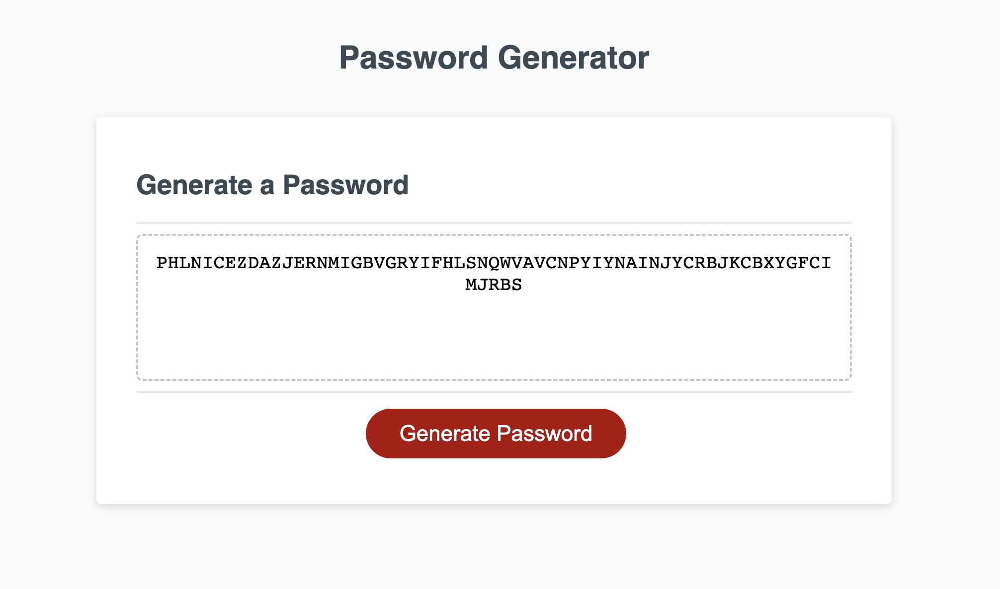

### Vinhs Special Password Generator

## What does it do?

This application takes prompt inputs from the user and it creates a password based on the selected prompts. The password has to be 10 to 64 characters and the user has the options (must choose at least one) to include either special characters, numeric characters, lower or uppercase characters.

## How did I make it?

Using Vanilla Javascript as followed:

- In this application I stored the different (array) options in seperate variables.
- Using prompts, I was able to take the inputs from the user and stored these options into a new global variable array using conditional statements to validate each user prompt response.
- I also stored the length of the password in a global variable.
- Using a for loop, I looped through the new array and used Math.floor(Math.random() to assign a random index and the number of loops was based on the password length specified by the user and created a new string to store the password.
- I then accessed the dom and displayed this on the page 

HTML + CSS was also used.

### Live Preview!

[Live Preview](https://vinhkietla.github.io/Vinhs-Special-Password-Generator-/)

### Screenshot of application

